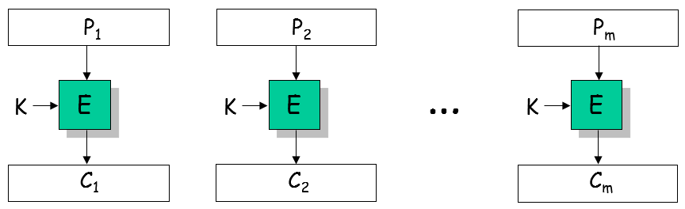
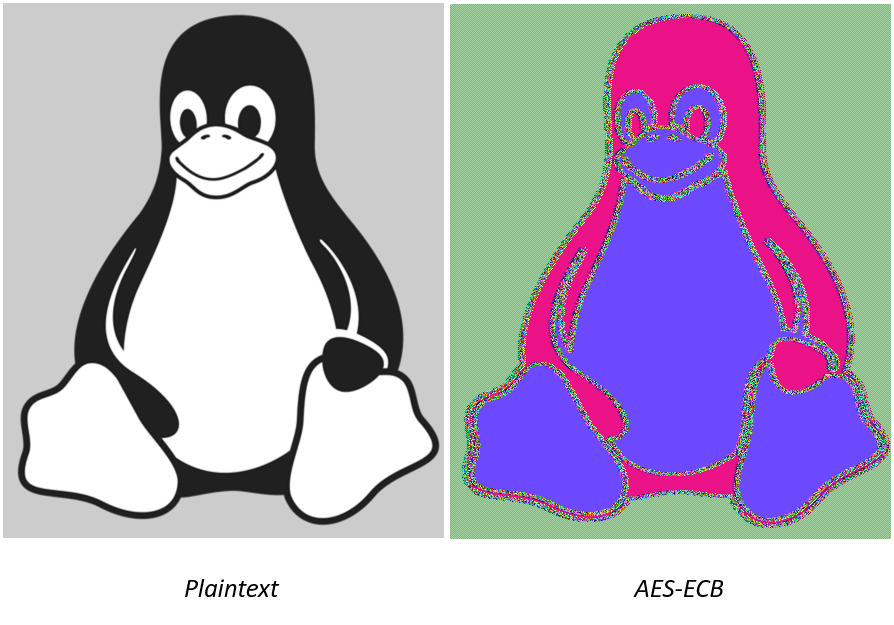

# **Kriptografija i mrežna sigurnost** <!-- omit in toc -->

- [Lab 3: Deterministic encryption (ECB mode)](#lab-3-deterministic-encryption-ecb-mode)
  - [Zadatak](#zadatak)
    - [Dohvaćanje autentikacijskog tokena](#dohvaćanje-autentikacijskog-tokena)
    - [Tajni `cookie`](#tajni-cookie)
    - [Dekripcijski ključ](#dekripcijski-ključ)
    - [Dekripcija izazova](#dekripcija-izazova)
  - [Korisne smjernice za automatizaciju u Pythonu](#korisne-smjernice-za-automatizaciju-u-pythonu)
    - [Spajanje stringova](#spajanje-stringova)
    - [Iteriranje kroz string](#iteriranje-kroz-string)
    - [Dohvaćanje tokena (POST /ecb/token)](#dohvaćanje-tokena-post-ecbtoken)
    - [Slanje HTTP zahtjeva autoriziranog tokenom](#slanje-http-zahtjeva-autoriziranog-tokenom)

# Lab 3: Deterministic encryption (ECB mode)

U okviru vježbe baviti ćemo se problematikom enkripcije poruka duljih od duljine bloka dane šifre/enkripcijskog algoritma (npr., 128 bit za AES blok šifru). Generalno u takvim slučajevima poruku dijelimo na blokove fiksne duljine koja odgovara duljini bloka korištenog enkripcijskog algoritma te na odgovarajući način enkriptiramo pojedine blokove. _Electronic Code Book_ (ECB) je postupak enkripcije dugih poruka u kojem blokove dane poruke enkriptiramo neovisno jedno od drugog. Ovakav postupak enkripcije je intuitivan i jednostavan, ali **nije siguran**. S obzirom da su blok šifre determinističke funkcije (isti ulaz u šifru, pod istim enkripcijskim ključem, uvijek daje isti/predvidiv izlaz), ECB enkripcijski mod rezultira **determinističkom enkripcijom**. Posljedično, ako su neki blokovi poruke identični to će rezultirati identičnim izlazom (_ciphertext_-tom) na osnovu čega (bilo tko) može zaključiti da su enkriptirane identične poruke.

<br/>
<p align="center">

<br><br>
<em>Enkripcija u ECB modu</em>
</p>

U vježbi ćemo pokazati da ovakav način enkripcije generalno ne osigurava povjerljivost (_confidentiality_) poruke unatoč tome što koristimo sigurnu šifru (npr., AES ili čak idealnu blok šifru).

<p align="center">

<br>
<em>Problem deterministične enkripcije</em>
</p>

## Zadatak

Dekriptirati odgovarajući izazov (_challenge_) koji je, kao i u prethodnoj vježbi, enkriptiran AES šifrom u CBC enkripcijskom modu, ključem izvedenim iz tajne vrijednosti _cookie_. Student će saznati tajni _cookie_ iskorištavanjem ranjivosti determinističke enkripcije (ECB enkripcijskog moda u ovoj vježbi).

Pojednostvaljeni prikaz zadatka:
> username & password ⇒ token ⇒ cookie ⇒ key ⇒ Chuck Norris fact

Prisjetite se, _password_ ste otkrili u prethodnoj vježbi.

### Dohvaćanje autentikacijskog tokena

> username & password ⇒ **token** ⇒ cookie ⇒ key ⇒ Chuck Norris fact

U ovoj vježbi student će slati HTTP POST zahtjeve _crypto oracle_ serveru na zaštićen _path_ `/ecb`. Za uspješan REST API poziv `POST /ecb` trebate odgovarajući autentikacijski token kojeg možete dobiti od _crypto_oracle_ servera u zamjenu za odgovarajuću zaporku koju ste otkrili u prethodnoj vježbi.

### Tajni `cookie`

> username & password ⇒ token ⇒ **cookie** ⇒ key ⇒ Chuck Norris fact

Iskoristiti činjenicu da _crypto oracle_ enkriptira _cookie_ u ECB modu (deterministička enkripcija). Slanjem proizvoljne poruke (_plaintext_) _crypto oracle_-u na _path_ `/ecb` isti će napraviti sljedeće:

  1. _crypto oracle_ će uzeti vaš _plaintext_ i spajati ga s tajnim _cookie_-jem (`plaintext + cookie`),
  2. enkriptirati rezultat (tj. `plaintext + cookie`) primjenom AES šifre u ECB modu tajnim ključem,
  3. vratiti vam odgovarajući _ciphertext_ (slika u nastavku).

<br/>
<p align="center">

<br><br>
<em>Primjena ECB moda u "crypto_oracle" serveru</em>
</p>

> NAPOMENA: Kao što je vidljivo iz slike, _crypto_oracle_ server će enkriptirati `plaintext + cookie + padding`; gdje se `padding` automatski dodaje iz razloga koje ćemo objasniti naknadno - ovaj detalj nije toliko relevantan za rješavanje tekućeg zadatka.

Nekoliko važnih napomena:

1. Ranjivost ECB enkripcijskog moda proizlazi iz činjnice da jednostavno možete otkriti podudarnost dva _plaintext_ bloka na način da uspoređujete _ciphertext_ blokove dobivene enkripcijom tih _plaintext_ blokova. Budući da se u slučaju ECB moda radi o determinističkoj enkripciji, isti _plaintext_ blok rezultirati će istim _ciphertext_ blokom; ako se koristi isti enkripcijski ključ (naš slučaj).

2. Razmislite kako bi trebali prilagoditi _plaintext_ poruke da bi vam ECB _oracle_ dao potencijalno korisnu informaciju. Koristite primitivna sredstva poput olovke i papira te pokušajte sebi skicirati ovaj problem.

    > Napad u kojem adaptivno prilagođavate _plaintext_ koji šaljete _crypto_oracle_ serveru na enkripciju, od kojeg dobivate odgovarajući _ciphertext_, pada u kategoriju **_chosen-plaintext_** napada.

3. Tajni _cookie_ dug je 16 byte-a i čine ga slova engleskog alfabeta.

4. S obzirom da **_chosen-plaintext_** napad zahtjeva slanje nekoliko stotina zahtjeva _crypto_oracle_ serveru, automatizirajte napad prema smjernicama danim kasnije u nastavku.

### Dekripcijski ključ

> username & password ⇒ token ⇒ cookie ⇒ **key** ⇒ Chuck Norris fact

**HINT:** Pogledati rezultate prošlih labova (kod za enkripciju/dekripciju _crypto_ izazova).

### Dekripcija izazova

> username & password ⇒ token ⇒ cookie ⇒ key ⇒ **Chuck Norris fact**

**HINT:** Pogledati rezultate prošlih labova (kod za enkripciju/dekripciju _crypto_ izazova).

Testirajte okriveni **_password_** za otključavanje sljedeće vježbe.

## Korisne smjernice za automatizaciju u Pythonu

### Spajanje stringova

```python
print("ab" + "c")
```

### Iteriranje kroz string

```python
for letter in "is this the real world or is this just fantasy":
    print(letter)
```

### Dohvaćanje tokena (POST /ecb/token)

```python
import requests

username = "username"
password = "password"
url = "http://your_IP_address/ecb/token"

response = requests.post(
    url=url,
    headers={
        "accept": "application/json",
        "Content-Type": "application/x-www-form-urlencoded"
    },     
    data = {
        "username": username,
        "password": password
    } 
)

# print(response.status_code)
token = response.json().get("access_token")
print(token)
```

### Slanje HTTP zahtjeva autoriziranog tokenom

```python
import requests

# First get the token as shown above
token = "your_token"
url = "http://your_IP_address/ecb"

response = requests.post(
    url=url,
    headers={
        "accept": "application/json",
        "Authorization": f"Bearer {token}",
        "Content-Type": "application/json"
    },    
    json = {"plaintext": "xyz"}
)

# response.raise_for_status()
print(response.json().get("ciphertext"))
```