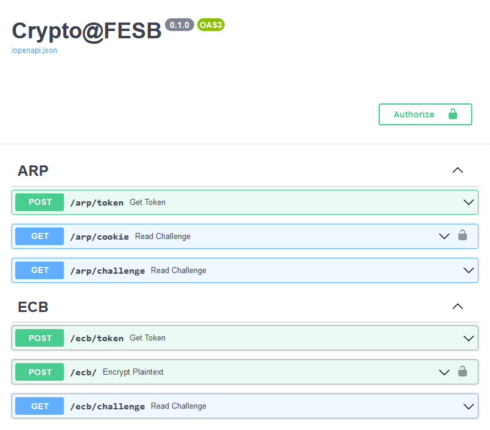
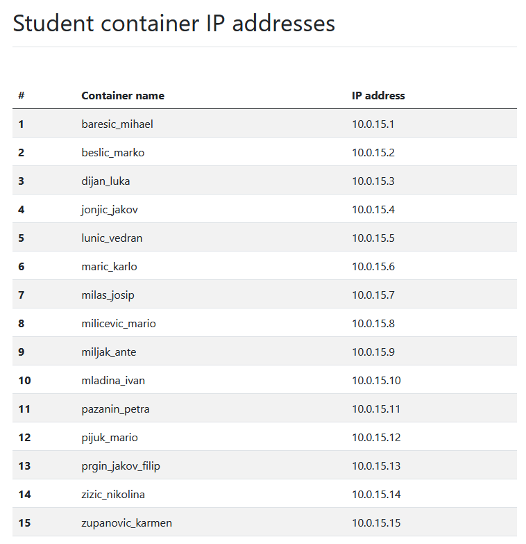
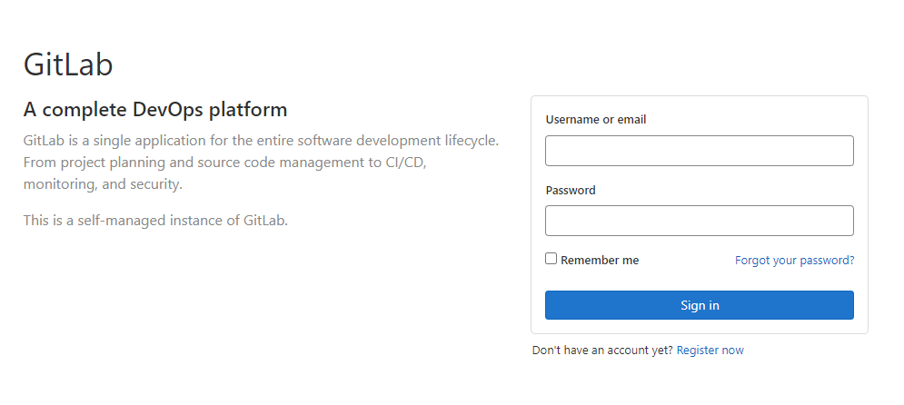

# **Kriptografija i mrežna sigurnost: Lab 1** <!-- omit in toc -->

- [Setting up the stage](#setting-up-the-stage)
  - [Uvod](#uvod)
  - [Pristup serveru](#pristup-serveru)
  - [Pohrana rješenja](#pohrana-rješenja)
  - [Postavljanje razvojnog okruženja](#postavljanje-razvojnog-okruženja)
    - [Visual Studio Code Development Container](#visual-studio-code-development-container)
    - [Python virtualno okruženje](#python-virtualno-okruženje)
- [Važni linkovi](#važni-linkovi)

## Setting up the stage

<p align="center">

<br>
<em>Crypto Oracle OpenAPI documentation</em>
</p>

### Uvod

Student rješava izazove u interackciji sa REST API serverom kojeg kolokvijalno nazivamo **_crypto oracle_**. _Crypto oracle_ generira izazove u obliku šifriranog/enkriptiranog teksta ([Chuck Norris facts](https://api.chucknorris.io/)) kojeg student treba dekriptirati. Dekripcijski ključ student treba otkriti u interakciji sa _crypto oracle_ serverom.

> Uspješnom dekripcijom izazova student, uz novu činjenicu o Chuck Norrisu, otkriva i **password** potreban za pristup sljedećoj vježbi.

Server je pisan u Pythonu web okviru [FastAPI](https://fastapi.tiangolo.com/). Izvorni kod servera dostupan je u ovom repozitoriju [crypto-oracle](/crypto-oracle/). Kriptografske funkcije dolaze iz Python biblioteke (*package*) [cryptography](https://cryptography.io).

### Pristup serveru

Za svakog studenta pokreće se personalizirana instanca _crypto oracle_ servera u vidu [Docker](https://www.docker.com/) *container*-a. Za pristup osobnom serveru student treba koristiti računalo koje ima pristup lokalnoj mreži u laboratoriju.

> Spajanjem putem WiFi mreže, ne možete ostvariti pristup serveru.

Osobnom serveru pristupate na osnovu odgovarajuće IP adrese. S obzirom da se adrese dodjeljuju dinamički, podložne su promjenama. Trenutnu adresu svog servera možete doznati putem sljedećeg linka: **http://containersinfo.local**.


<p align="center">

<br>
<em>List of student containers</em>
</p>
<br/>

### Pohrana rješenja

Student pohranjuje rješenja u odgovarajući repozitorij na **loklanoj instanci GitLab servera** dostupnoj na adresi **http://gitlab.local**. Rješenje uključuje:

- Dešifrirani izazov (činjenicu o Chuck Norrisu)
- Dešifriran _password_ (nužan za otključavanje sljdeće vježbe)
- Izvorni kod rješenja (Python skripta)
- Odgovore na pripremna pitanja kao i pitanja iz vježbe (gdje je to potrebno) 
  
Student se prijavljuje na **lokalni** [GitLab server](http://gitlab.local) s korisničkim imenom i lozinkom izvedenim iz osobnog imena kako je dano u primjeru u nastavku:


| Ime | Prezime | `username` | `password` |
| :--- |:--- |:--- |:--- |
| Ivan | Ivić | `ivic_ivana` | `ivic_ivana` |
| Marko Ivan | Markovic | `markovic_marko_ivan` | `markovic_marko_ivan` |
| Mirta | Marić Banje | `maric_banje_mirta` | `maric_banje_mirta` |

<p align="center">

<br>
<em>GitLab server login page</em>
</p>
<br/>

### Postavljanje razvojnog okruženja

Preporučamo korištenje Python programskog jezika za rješavanje izazova iako je moguće koristiti proizvoljan programski jezik. _Crypto oracle_ server je pisan u Pythonu pa možete iskoristiti izvorni kod servera kao referencu za rješavanje izazova.

#### Visual Studio Code Development Container

Ovo je preferiran način postavljanja razvojnog okruženja koji osigurava identično razvojno okruženje na svim računalima. Potrebno je instalirati ekstenziju [Dev Containers](https://marketplace.visualstudio.com/items?itemName=ms-vscode-remote.remote-containers) te osigurati (na Windows računalima) da je pokrenut [Docker Desktop](https://www.docker.com/products/docker-desktop).

Nakon toga, u _Visual Studio Code_-u jednostavno otvorite direktorij u kojem se nalazi predložak koda za danu laboratorijsku vježbu; predložak koda klonirate sa lokalnog GitLab servera.

> Inicijalno pokretanje razvojnog okruženja može potrajati obzirom da _Visual Studio Code_ preuzima i konfigurira sve potrebne komponente za izgradnju Docker _image_-a. Naknadno pokretanje razvojnog okruženja, za dani direktorij, znatno je brže.

#### Python virtualno okruženje

Ako se pokaže da _Visual Studio Code_ razvojno okruženje nije moguće koristiti (greške, izuzetno sporo pokretanje), možete koristiti **Python virtualno okruženje**. Efektno, ovo znači da svaki Python projekt može imati instalirane vlastite biblioteke (*package*), neovisno o bibliotekama drugih projekata. Tako npr., korištenjem virtualnih okruženja različiti Python projekti na istom sustavu mogu ovisiti o različitim verzijama iste biblioteke a da ne utječu jedni na druge. Broj virtualnih okruženja koje možete kreirati je praktično neograničen.

U nastavu su kratke upute za kreiranje virtualnih okruženja.

1. Uvjerite se da imate instaliran Python verzija 3.10.9 (https://www.python.org/downloads/). U terminalu izvršite sljedeću naredbu.

    ```bash
    pyhton3 --version
    ```

2. Kreirajte osobni direktorij (npr. `ivic_ivana`) i uđite u njega.
3. Kreirajte odgovarajuće virtualno okruženje izvršavanjem sljedeće naredbe u terminalu.

   ```bash
   python -m venv crypto
   # "crypto" je proizvoljan naziv virtualnog okruženja
   ```

4. Aktiviranje virtualnog okruženja.

     - Windows (`cmd` terminal):
  
        ```bash
        # Nalazite se u osobnom direktoriju (npr. `ivic_ivana`)
        cd crypto\Scripts
        activate
        ```

     - Windows (`ps` terminal):
  
        ```bash
        # Nalazite se u osobnom direktoriju (npr. `ivic_ivana`)
        . .\crypto\Scripts\activate 
        ```

5. Ako je prethodni korak bio uspješan _command prompt_ će dobiti prefix `(crypto)`:

   ```bash
   (crypto) C:\A507\students\ivic_ivana>
   ```

    Možete se slobodno kretati po direktorijima; virtualno okruženje će biti aktivno.

6. Python _package_ koji instalirate dok je virtualno okruženje aktivirano biti će dostupan isključivo iz tog virtualnog okruženja i neće ometati druga okruženja.

    ```bash
    # install package "cryptography"
    pip install cryptography
    
    # install all packages from requirements.txt
    pip install -r requirements.txt
    ```

7. Deaktivacija virtualnog okruženja. U bilo kojem direktoriju izvršite sljedeće:

    ```bash
    (crypto) C:\A507\students\ivic_ivana> deactivate
    ```

    Virtualno okruženje možete aktivirati proizvoljan broj puta.

8. Konačno, direktorij možete otvoriti u Visual Studio Code editoru kako slijedi:

    ```bash
    (crypto) C:\A507\students\ivic_ivana> code .
    ```

<br/>

## Važni linkovi

- [Python `cryptography` package](https://cryptography.io)
- [Crypto Oracle source code](/crypto-oracle/)
  
Interni linkovi (dostupni isključivo sa lokalne mreže):

- [What is my _crypto oracle_ container's IP?](http://containersinfo.local)
- [Local GitLab server](http://gitlab.local)